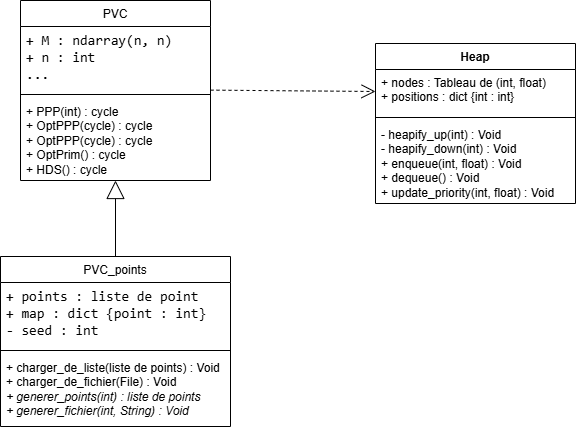

# PVC

Résolution du Problème du Voyageur de Commerce (TSP)  
Implémentation en Python d’heuristiques constructives et d’algorithmes exacts pour le TSP, incluant **Plus Proche Points (PPP)**, **PVCPrim** et **Branch and Bound (HDS)**. Génération de statistiques et visualisation graphique des résultats.

---

## Résolution du Problème du Voyageur de Commerce (TSP)

Ce projet implémente plusieurs méthodes pour résoudre le **Problème du Voyageur de Commerce (TSP)** en Python, allant des heuristiques constructives aux algorithmes exacts.

---

## Fonctionnalités

- **PPP (Point le Plus Proche)** : heuristique constructive rapide.
- **OptPPP** : amélioration de PPP via décroisement des arêtes.
- **PVCPrim / OptPrim** : approximation basée sur un arbre couvrant minimum.
- **HDS** : algorithme exact basé sur **Branch and Bound** avec heuristique de demi-somme.
- Analyse statistique des heuristiques sur ensembles de points aléatoires.
- Visualisation des résultats via histogrammes et comparaisons graphiques.

---

## Prérequis

- Python 3.12 ou supérieur
- Modules Python :
  - `numpy`
  - `matplotlib`
  - `heapq` (intégré à Python)

---

## Structure du projet

## Diagramme de classes du projet

---

## Description détaillée des dossiers et fichiers

- **src/** : Contient tout le code source Python :
  - `PVC.py` : Structures de données pour les graphes et cycles, implémentations des algorithmes (PPP, OptPPP, Prim, HDS).
  - `PVC_points.py` : Gestion des points 2D, calcul de distances, conversion en matrice et wrapper pour exécuter les algorithmes facilement.
  - `heap.py` : Structures et fonctions pour la gestion de tas et changement de priorité, utilisées par HDS et Prim.

- **data/** : Fichiers de tests, comprenant des ensembles de points aléatoires ou prédéfinis, pouvant être utilisés par les notebooks pour l’analyse.

- **tex/** : Fichiers tex des pdf disponibles.

- **algorithmes/** : Documentation PDF détaillant chaque algorithme implémenté :
  - `ppp.pdf` : Algorithme Point le Plus Proche.
  - `prim.pdf` : Algorithme de Prim et sa variante OptPrim.
  - `hds.pdf` : Algorithme exact HDS (Branch and Bound).

- **exemple_utilisation.ipynb** : # Notebook d'exemples d'utilisation.

- **statistiques.ipynb** : # Notebook pour analyse statistique et visualisation.

- **rapport.pdf** : Rapport complet du projet.

- **notice_utilisation.pdf** : # Notice d'utilisation.

- **requirements.txt** : # Dépendances Python.

- **README.md** : Présente le projet, sa structure, les instructions d’installation et d’utilisation.


---

## Utilisation

### Exemple simple

```python
from src.PVC_points import PVC_points
import numpy as np

# Générer 10 points aléatoires
points = np.random.rand(10, 2)
tsp = PVC_points(points)
tsp.charger_de_liste(points)

# Exécuter les algorithmes
cycle_ppp = tsp.PPP(points[0])
cycle_opt = tsp.OptPPP(points[0])
cycle_prim = tsp.PVCPrim()
best_cycle = tsp.HDS()

# Afficher les résultats
print("PPP :", tsp.longueur(cycle_ppp))
print("OptPPP :", tsp.longueur(cycle_opt))
print("PVCPrim :", tsp.longueur(cycle_prim))
print("HDS :", tsp.longueur(cycle_hds))

---

Auteur

Mohamed Elakef Zenagui
